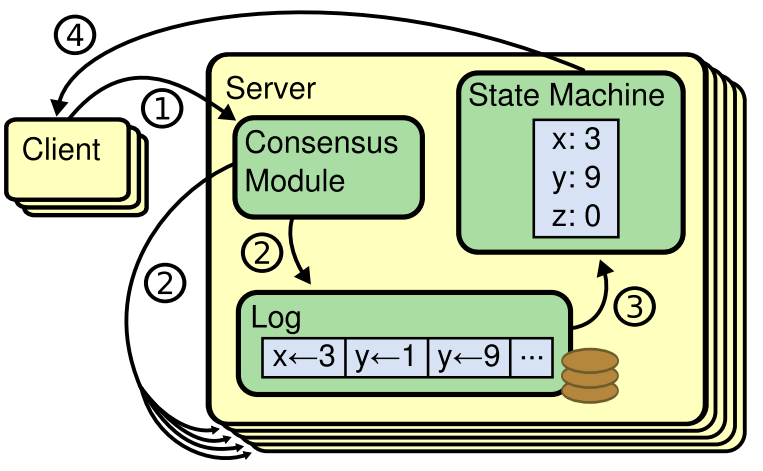
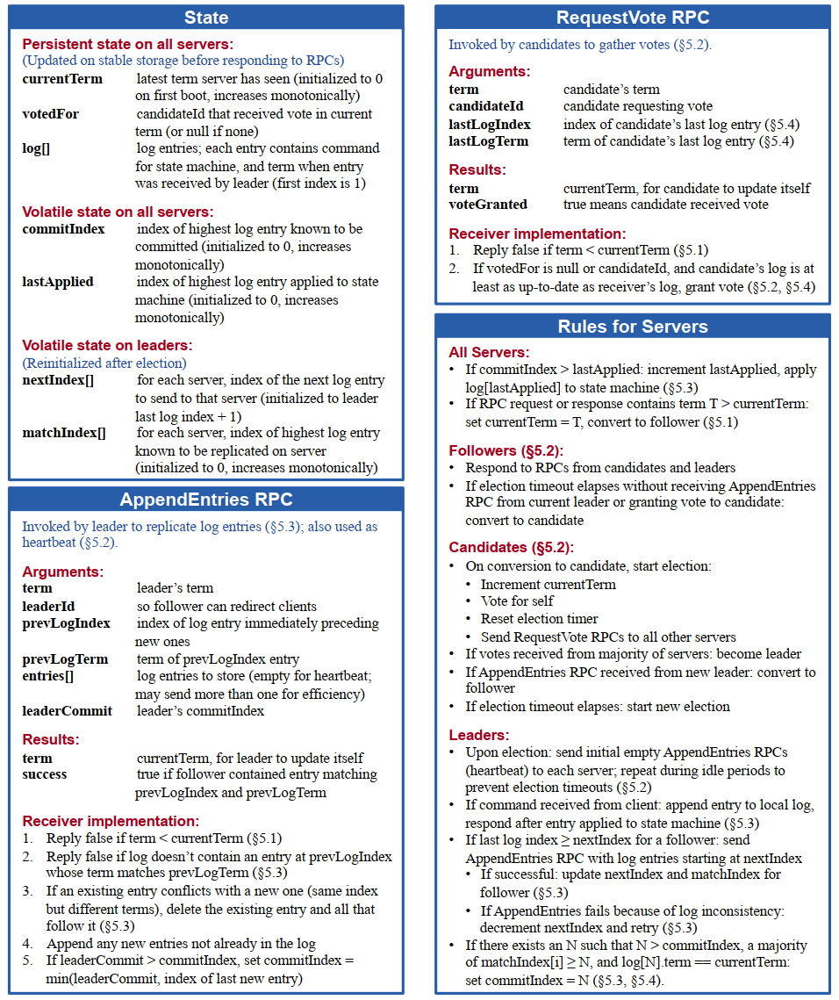
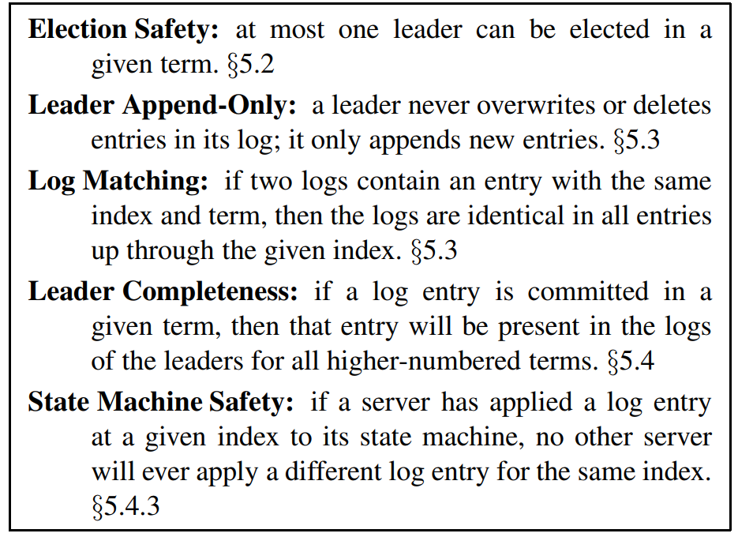
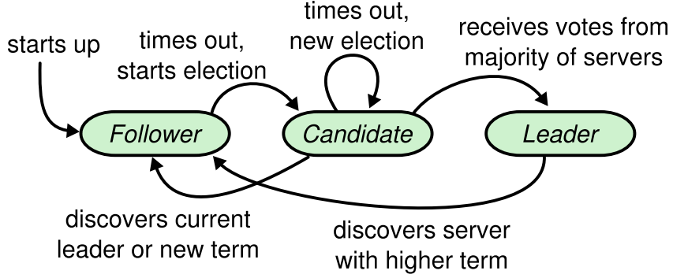

# Raft（扩展版）——中文完整翻译（工作稿）

说明：本文件为 `raft-extended.pdf` 的中文译文工作稿。排版以 Markdown 为主，等式与公式保持原样或使用行内形式描述；图表标题以“图/表”编号标注。随着进度推进会逐步完善术语一致性与交叉引用。

目录：
- 摘要
- 术语与约定
- 1 引言（Introduction）
- 2 复制状态机
- 3 Paxos 的问题在哪里？
- 4 为“可理解性”而设计
- 5 Raft 一致性算法（概述）
- 6 集群成员变更
- 7 日志压缩（Log compaction）
- 8 客户端交互（Client interaction）
- 9 实现与评估
- 10 相关工作
- 11 结论

---

### 术语与约定
- leader（领导者）、follower（跟随者）、candidate（候选人）：为便于对照实现与原文，文中多保留英文小写写法。
- term：任期；election timeout：选举超时；heartbeat：心跳。
- commit/committed：提交/已提交；log entry：日志条目。
- AppendEntries、RequestVote：RPC 名保留英文。
- Log Matching Property：日志匹配性质；Leader Completeness Property：领导者完整性；State Machine Safety Property：状态机安全性。
- joint consensus：联合一致；snapshot（snapshotting）：快照（快照化）。

## 摘要

Raft 是一种用于管理复制日志的一致性算法。它产生与（多）Paxos 等价的结果，效率也与 Paxos 相当，但其结构与 Paxos 不同；这使得 Raft 比 Paxos 更易理解，并且为构建实际系统提供了更好的基础。为增强可理解性，Raft 将一致性的关键要素进行分解，例如领导者选举、日志复制与安全性，并通过更强的内在一致性来减少必须考虑的状态数目。用户研究的结果表明，学生学习 Raft 比学习 Paxos 更容易。Raft 还包含一种新的集群成员变更机制，采用重叠多数派来保证安全性。

## 1 引言（Introduction）

一致性算法使一组机器能够作为一个连贯整体工作，并能在部分成员发生故障时继续存活。因此，它们在构建可靠的大规模软件系统中发挥关键作用。过去十年间，Paxos 在一致性算法的讨论中占据主导：大多数一致性实现基于或受 Paxos 影响，Paxos 也成为教学一致性的主要载体。

然而，尽管有大量尝试让其更易接近，Paxos 仍然相当难以理解。此外，其体系结构在支持实用系统时需要复杂的改造。结果是，无论系统构建者还是学生，都在与 Paxos 斗争。

我们自己在与 Paxos 斗争之后，开始探索一种新的共识算法，希望它能为系统构建与教育提供更好的基础。我们的方法不同寻常：我们的首要目标是“可理解性”。我们能否为实用系统定义一种一致性算法，并以一种显著比 Paxos 更容易学习的方式描述它？此外，我们希望该算法有助于形成系统构建者所必需的直觉。不仅要让算法可用，还要让“它为什么可用”变得显而易见。

这一工作的结果就是 Raft。为了提升可理解性，我们采用了具体技术，包括“分解”（Raft 将领导者选举、日志复制与安全性进行分解）以及“状态空间约简”（相较 Paxos，Raft 降低了非确定性程度以及服务器之间可能不一致的方式）。一项覆盖两所大学、43 名学生的用户研究显示：在学习了两种算法之后，他们对 Raft 的答题表现显著优于对 Paxos 的表现。

Raft 在很多方面与现有一致性算法相似（尤其是 Oki 与 Liskov 的 Viewstamped Replication），但也具有若干新特性：

- 强领导者：Raft 采用更强的领导方式。例如，日志条目只能从领导者流向其他服务器。这简化了复制日志的管理，使 Raft 更易理解。
- 领导者选举：Raft 使用随机化定时器进行选举。这仅在心跳机制之上增加了少量开销，却可以简单而迅速地化解冲突。
- 成员变更：Raft 在集群成员变更上采用新的“联合一致（joint consensus）”方法，在过渡期让两种不同配置的多数派发生重叠。这样集群便能在变更期间正常运转。

我们认为，无论在教学还是在实现基础上，Raft 都优于 Paxos 与其他一致性算法。它更简单、更易理解；其描述足够完整，能满足实用系统的需求；它拥有多个开源实现并已被多家公司采用；其安全性已被形式化刻画并证明；其效率与其他算法相当。

本文其余部分如下：第 2 节介绍复制状态机问题；第 3 节讨论 Paxos 的优劣；第 4 节阐述我们关于“可理解性”的一般方法；第 5–8 节给出 Raft 一致性算法；第 9 节评估 Raft；第 10 节讨论相关工作。

## 2 复制状态机

一致性算法通常出现在复制状态机（replicated state machines，RSM）[37] 的语境中。该方法在多台服务器上运行状态机，计算相同状态的相同副本，即便部分服务器宕机也能继续运行。复制状态机用于解决分布式系统中的多种容错问题。例如，那些在大规模系统中拥有单一集群领导者的系统（如 GFS [8]、HDFS [38]、RAMCloud [33]）通常使用一个单独的复制状态机来管理领导者选举，并存储必须在领导者崩溃后仍然持久的配置信息。复制状态机的典型系统包括 Chubby [2] 与 ZooKeeper [11]。

> 图 1：复制状态机架构。共识算法管理包含客户端状态机命令的复制日志。各状态机处理来自日志的相同命令序列，因此产生相同输出。

复制状态机通常基于复制日志实现，如图 1 所示。每台服务器存储一个包含一系列命令的日志，其状态机会按序执行这些命令。每份日志都以相同顺序包含相同的命令，因此每个状态机都处理相同的命令序列。由于状态机是确定性的，它们计算出相同的状态并产生相同的输出序列。

保持复制日志一致是共识算法的职责。服务器上的一致性模块从客户端接收命令并将其追加到本地日志；它与其他服务器上的一致性模块通信，以确保即便部分服务器发生故障，每份日志最终都包含相同顺序的相同请求。一旦命令被正确复制，每台服务器的状态机就按日志顺序处理这些命令，并将输出返回给客户端。因此，这些服务器对外表现为一个单一且高度可靠的状态机。

实际系统中的一致性算法通常具备以下性质：
- 安全性：在所有非拜占庭条件下都不返回错误结果，包括网络延迟、分区、丢包、重复与乱序。
- 可用性：只要任意多数服务器可用并且彼此及与客户端之间可通信，系统就完全可用。因此，一个五节点集群可容忍任意两台服务器的失效。假设服务器以停机方式失败；它们之后可以从稳定存储中的状态恢复并重新加入集群。
- 一致性不依赖定时：用于确保一致性的机制不依赖时钟。最坏情况下，时钟错误与极端消息延迟只会影响可用性，不会破坏安全性。
- 常见情形下的高效性：在常见情形下，一条命令在集群多数响应一次远程过程调用（RPC）往返后即可完成；少数慢节点不会影响整体系统性能。

## 3 Paxos 的问题在哪里？

在过去十年里，Leslie Lamport 的 Paxos 协议 [15] 几乎成为“共识”的同义词：它是课程中最常教授的协议，大多数一致性实现也以其为起点。Paxos 首先定义了一个能够对单个决策达成一致的协议，例如对一条复制日志条目达成一致。我们将这一子集称为“单令（single-decree）Paxos”。随后，将该协议的多个实例组合起来以支持一系列决策，例如形成一条日志（multi-Paxos）。Paxos 既保证安全性又保证活性，并支持集群成员变更；其正确性已被证明，且在正常情况下效率较高。

不幸的是，Paxos 存在两大缺点。其一，Paxos 极难理解。其完整讲解 [15] 以晦涩著称；极少有人能真正理解，且往往需要付出巨大努力。因此，出现了多种更简化的解释 [16, 20, 21]。这些解释聚焦于单令子集，但仍然颇具挑战。我们在 NSDI 2012 的一次非正式调查中发现，即便在资深研究者中，也鲜有人对 Paxos 感到自如。我们自己与 Paxos 的斗争亦持续许久：只有在阅读了多个简化解释并设计出我们自己的替代协议之后，才逐步理解完整协议，这个过程耗时近一年。

我们推测，Paxos 的晦涩源于其选择了“单令子集”作为基础。单令 Paxos 既紧凑又微妙：分成两个缺乏直观解释、且彼此并不能独立理解的阶段。由此，很难建立单令协议为何有效的直觉。将其组合成 multi-Paxos 的规则又引入了大量复杂性与微妙之处。我们相信，对于对多个决策达成一致这一总体问题（例如，对一条日志而非单条记录达成一致），可以用更直接、更显然的方式来分解。

第二个问题是，Paxos 并不为构建实用实现提供良好的基础。原因之一是对于 multi-Paxos 并无广泛认同的算法。Lamport 的描述主要针对单令 Paxos；他对 multi-Paxos 只勾勒了若干可能路径，但缺失许多细节。尽管有多项工作试图充实与优化 Paxos，如 [26]、[39]、[13]，但这些方案彼此之间以及相对 Lamport 的草图都有差异。像 Chubby [4] 这类系统实现了类似 Paxos 的算法，但多数情况下细节并未公开。

此外，Paxos 的体系结构并不适合构建实用系统；这同样源于其“单令式”的分解。例如，独立地选择一批日志条目、再将它们拼接成一条顺序日志并无太大益处，反而增加复杂度。围绕日志来设计系统会更简单高效：新条目按受约束的顺序顺序追加。另一个问题是，Paxos 的核心采用对称的点对点方法（尽管最终建议以一种较弱的领导方式作为性能优化）。这在只做一次决策的简化世界里说得通，但实际系统鲜少如此。当需要持续做出一系列决策时，先选出领导者、再由领导者协调决策会更简单、更快速。

因此，实用系统与 Paxos 相差甚远。每个实现都从 Paxos 开始，随后在实现过程中遭遇困难，最终发展出显著不同的架构。这个过程既耗时又易出错，而理解 Paxos 的困难更是雪上加霜。Paxos 的形式化表达也许有利于对其正确性的证明，但真实系统实现与其差异过大，以至于这些证明价值有限。Chubby 实现者的一段评论很典型：
“Paxos 算法的描述与真实世界系统的需要之间存在显著鸿沟……最终的系统将基于一个未经证明的协议 [4]。”

基于上述问题，我们认为 Paxos 既不利于系统构建，也不利于教学。鉴于一致性在大规模软件系统中的重要性，我们决定尝试设计一种相较 Paxos 具有更好属性的替代一致性算法。Raft 即是这一实验的结果。

## 4 为“可理解性”而设计

我们在设计 Raft 时有若干目标：它必须为系统构建提供完整且实用的基础，从而显著减少开发者需要自行设计的工作量；它必须在所有条件下保持安全、并在典型工作条件下可用；且在常见操作上要高效。但最重要、也是最具挑战的目标是“可理解性”：应当让广大读者都能舒适地理解该算法；同时也要便于形成对算法的直觉，以便系统构建者能在真实实现中进行难以避免的扩展。

在 Raft 的设计过程中，我们多次需要在不同方案之间做出选择。此时我们以“可理解性”为准绳来评估备选方案：解释每个方案的难度如何（例如，其状态空间有多复杂、是否有微妙之处），读者能否完整、清晰地理解该方案及其含义？

我们意识到，这样的分析具有较强主观性；不过我们采用了两种普适的技术。第一种是众所周知的“问题分解”：尽可能将问题拆分为可以相对独立地解决、解释与理解的部分。例如，在 Raft 中我们将领导者选举、日志复制、安全性与成员变更彼此分离。第二种是通过减少需要考虑的状态数量来简化状态空间，从而提升系统内在一致性并在可能处消除非确定性。具体而言，不允许日志出现“空洞”；同时限制日志之间可能不一致的方式。尽管多数情况下我们消除了非确定性，但在某些情形中，非确定性反而有助于可理解性。特别地，随机化方法引入非确定性，但它们往往通过“所有选择都等价”的方式来缩小状态空间（“随便选哪个都行”）。我们利用随机化来简化 Raft 的领导者选举算法。

## 5 Raft 一致性算法（概述）

> 图 2：Raft 共识算法（精简版，未含成员变更与日志压缩）。上方左侧的“服务器规则”以可独立、重复触发的规则集描述。细节见相应小节（如 §5.2）。

Raft 是一个用于管理第 2 节所述复制日志的算法。图 2 对算法进行了压缩总结以便参考，图 3 列出了算法的关键性质；本节其余部分将逐一讨论这些要素。

> 图 3：Raft 始终保证以下性质（对应小节）——选举安全性（§5.2）、领导者追加性（§5.3）、日志匹配性质（§5.3）、领导者完整性（§5.4）、状态机安全性（§5.4.3）。

Raft 先选举出一个被区分出来的领导者（leader），然后将管理复制日志的全部职责交给领导者。领导者从客户端接收日志条目，将其复制到其他服务器，并在可以安全地将日志条目应用到各自状态机时通知各服务器。引入领导者简化了复制日志的管理。例如，领导者可以无需咨询其他服务器就决定新条目在日志中的位置，且数据以简单的方式从领导者流向其他服务器。领导者可能失败或与其他服务器失联，此时会选举出新的领导者。

基于领导者的方法，Raft 将共识问题分解为三个相对独立的子问题（后续小节分别讨论）：
- 领导者选举：当现有领导者失败时，需要选出新的领导者（§5.2）。
- 日志复制：领导者必须从客户端接收日志条目，并将其复制到整个集群，强制其他日志与自身达成一致（§5.3）。
- 安全性：Raft 的关键安全属性见图 3 的“状态机安全性”：如果任一服务器已将某个日志条目应用到其状态机，那么不会有其他服务器在相同索引处应用不同的命令（§5.4）。为确保该属性，需要在 §5.2 的选举机制上增加一条限制。

在呈现共识算法之后，本节还将讨论可用性与时序的角色。

- 服务器规则（节选）
  - 所有服务器：若 commitIndex > lastApplied，则递增 lastApplied 并将 log[lastApplied] 应用到状态机（§5.3）。若任何 RPC 的任期 T > currentTerm，则令 currentTerm = T 并转为 follower（§5.1）。
  - Follower（§5.2）：响应来自 candidate 与 leader 的 RPC；若在选举超时内既未收到当前 leader 的 AppendEntries，也未对候选人投票，则转为 candidate。
  - Candidate（§5.2）：转换为 candidate 时发起选举：递增 currentTerm、给自己投票、重置选举计时器，并向所有其他服务器并行发送 RequestVote。若获多数票则成为 leader；若收到新 leader 的 AppendEntries 则转为 follower；若选举超时则重新发起选举。
  - Leader：当选后立即向各服务器发送空 AppendEntries（心跳）并在空闲时持续发送防止超时（§5.2）。收到客户端命令时，先将条目追加到本地日志，待条目应用到状态机后再响应（§5.3）。若某 follower 的 nextIndex 未追上，则从该索引开始发送 AppendEntries；成功则更新 nextIndex 与 matchIndex；若因不一致失败则递减 nextIndex 并重试（§5.3）。若存在 N 使 N > commitIndex，且多数 matchIndex[i] ≥ N，且 log[N].term == currentTerm，则将 commitIndex 置为 N（§5.3，§5.4）。

### 5.1 Raft 基础

一个 Raft 集群包含若干服务器（通常为 5 台，可容忍 2 台失效）。任一时刻每台服务器处于三种状态之一：leader、follower 或 candidate。正常情况下恰有一个 leader，其余均为 follower。Follower 被动，只响应来自 leader 与 candidate 的请求；leader 处理所有客户端请求（若客户端联系到 follower，follower 会将其重定向到 leader）。第三种状态 candidate 用于按照 §5.2 选举新的 leader。图 4 展示了状态与转换。

> 图 4：服务器状态。跟随者仅响应来自其他服务器的请求。如果跟随者未收到任何通信，它将转变为候选人并发起选举。获得整个集群中多数选票的候选人将成为新的领导者。领导者通常会一直运作直至发生故障。

Raft 将时间划分为长度不定的“任期”，以连续整数编号（图 5）。每个任期以一次选举开始：一个或多个候选人尝试成为 leader（§5.2）。若某候选人获胜，则在该任期剩余时间担任 leader；也可能出现“平票”，此时该任期以无 leader 结束，很快进入新任期（新一轮选举）。Raft 确保同一任期至多存在一个 leader。

不同服务器可能在不同时间观察到任期的边界，某些服务器甚至错过一次选举或整个任期。任期在 Raft 中充当逻辑时钟，有助于识别过时信息（如陈旧 leader）。每台服务器持久化保存“当前任期”并单调递增；服务器交互时交换任期，如果发现自身较小则更新为较大值。若 candidate 或 leader 发现自身任期落后，会立即变为 follower；若服务器收到带有陈旧任期的请求，会拒绝该请求。

Raft 通过 RPC 通信，基本算法只需两类 RPC：候选人在选举期间发起的 RequestVote（§5.2），leader 用于复制日志与心跳的 AppendEntries（§5.3）。§7 将引入第三类用于快照传输的 RPC。若超时未收到响应则重试，且为性能考虑并行发起 RPC。

### 5.2 领导者选举

Raft 使用心跳机制触发选举。服务器启动时均为 follower，只要持续接收到来自 leader 或 candidate 的有效 RPC，就保持 follower。Leader 周期性向所有 follower 发送心跳（不携带日志条目的 AppendEntries）以维持其权威。若 follower 在“选举超时”期间未收到任何通信，则假定无可用 leader 并发起选举：递增当前任期、转为 candidate、给自己投票，并向所有其他服务器并行发送 RequestVote RPC。Candidate 会一直保持该状态直至出现三种结果之一：（a）赢得选举；（b）其他服务器确立为 leader；（c）超时无人获胜。

获胜条件：在同一任期中获得集群多数服务器的投票。每台服务器在单个任期内最多投票一次（先到先得；§5.4 还会增加一个投票限制）。多数规则确保“选举安全性”（图 3）。当选后，candidate 成为 leader，并向所有服务器发送心跳以确立权威并防止新选举。

在等待投票期间，candidate 可能收到来自其他服务器（自称 leader）的 AppendEntries。若该 RPC 的任期不小于 candidate 的当前任期，则认可其为合法 leader 并转为 follower；若该任期更小，则拒绝并继续作为 candidate。

平票：若多台 follower 同时成为 candidate，票数可能分裂，导致无人获胜。此时各 candidate 会超时、递增任期并再次发起 RequestVote 新一轮。若不加措施，这种分裂可能无限持续。Raft 通过随机化“选举超时”来避免与快速化解平票：在固定区间（如 150–300ms）内均匀随机选择超时，这使得大多数情况下仅有一台服务器首先超时，从而率先赢得选举并在其他服务器超时前发出心跳。对于已发生的平票，每个 candidate 在新一轮开始时重置随机超时并等待到期再发起下一次选举，从而降低再次平票的概率（§9.3 显示该方法能快速选出 leader）。

### 5.3 日志复制

选出 leader 后，开始为客户端服务。每个客户端请求包含要由复制状态机执行的命令。Leader 将该命令作为新条目追加到自身日志，并并行向其他服务器发起 AppendEntries 以复制该条目。当该条目被“安全复制”（如下所述）后，leader 将其应用到状态机并将执行结果返回客户端。若 follower 崩溃或变慢，或网络丢包，leader 会无限期重试 AppendEntries（即便已响应客户端），直至所有 follower 最终存储所有日志条目。

日志组织如图 6。每条目包含状态机命令与接收该条目时的 leader 任期；条目中的任期用于检测日志间不一致并保证图 3 的若干性质。每个条目同时具有整数索引，标识其在日志中的位置。

“提交”由 leader 决定：当条目可安全应用到状态机时即视为已提交。Raft 保证已提交的条目是持久的，并最终会被所有可用状态机执行。创建该条目的 leader 将其复制到集群多数服务器后，该条目即被提交（同时也提交 leader 日志中该条目之前的所有条目，包括前任 leader 所写的条目）。在 leader 变更后应用此规则存在一些微妙之处，§5.4 将讨论并证明其安全。Leader 维护“已知已提交的最高索引”（commitIndex），并在后续 AppendEntries（含心跳）中携带该索引，使其他服务器最终得知；follower 一旦得知某条目已提交，就按日志顺序将其应用到状态机。

为提升日志间一致性水平（便于推理与保证安全），Raft 维持以下属性（共同构成图 3 的“日志匹配性质”）：
- 若两份日志在相同索引处拥有相同任期的条目，则它们存储的是同一命令。
- 若两份日志在相同索引处拥有相同任期的条目，则两份日志在该索引之前的所有条目完全相同。

上述第一条源于：leader 在给定任期内、给定索引至多创建一个条目，且条目位置固定不变。第二条由 AppendEntries 的一致性检查保证：leader 在 AppendEntries 中包含新条目前一条目的索引与任期；若 follower 在该索引处没有相同任期的条目，则拒绝新的条目。这一检查是归纳步：空日志初始满足“日志匹配性质”，而一致性检查在日志扩展时保持该性质。因此，一旦 AppendEntries 成功返回，leader 知道 follower 的日志至少在新条目范围内与自身一致。

正常运行时 leader 与 follower 的日志保持一致，因此一致性检查通常不会失败。但 leader 崩溃可能留下不一致（旧 leader 未能完全复制其日志）。随着多次 leader/follower 崩溃，这些不一致可能叠加。图 7 展示了新 leader 上任时 follower 日志可能出现的多种差异：缺少 leader 的条目、多出未提交条目，或二者兼有，且可跨多个任期。

Raft 由 leader 主动“纠偏”：强制 follower 的日志复制自身，从而覆盖 follower 日志中与 leader 冲突的条目（§5.4 将说明配合额外限制该做法是安全的）。为此，leader 需要找到两者最新的匹配位置，删除 follower 从该位置之后的所有条目，并发送自身该位置之后的全部条目。这些操作都由 AppendEntries 的一致性检查驱动。Leader 为每个 follower 维护 `nextIndex`，表示将发往该 follower 的下一条目索引。新 leader 上任时，将所有 `nextIndex` 初始化为其最后日志索引加一。若 follower 日志与 leader 不一致，则下一次 AppendEntries 会失败；leader 随后递减 `nextIndex` 并重试。最终 `nextIndex` 会回退到双方日志匹配的位置；此时 AppendEntries 会成功，从而删除 follower 中的冲突条目并追加来自 leader 的条目。成功后，该 follower 的日志与 leader 一致，并在该任期内保持一致。

可选优化：follower 在拒绝 AppendEntries 时可附带“冲突条目的任期”和“该任期在本地首次出现的索引”。Leader 据此可一次性跳过该任期内所有冲突条目，从而将“每个冲突任期一次 RPC”替代为“每个冲突条目一次 RPC”。考虑到故障不常见，该优化通常非必要。

通过上述机制，新 leader 上任时无需采取特别措施来修复日志一致性：直接进入正常复制即可；一致性检查失败会驱动日志自动收敛。Leader 从不覆盖或删除自身日志（见图 3 的“领导者追加性”）。整体来看，Raft 满足 §2 所述的理想共识特性：只要多数存活即可接受、复制、应用新条目；常见情况下单轮往返即可将新条目复制到多数；单个慢 follower 不影响整体性能。

### 5.4 安全性

前述机制描述了如何选举 leader 与复制日志；但仅靠这些还不足以确保每台状态机以完全相同的顺序执行完全相同的命令。如下情形说明问题：某 follower 在 leader 提交若干条目期间不可用，随后该 follower 当选为新 leader 并用新条目覆盖了旧条目，导致不同状态机执行不同序列。

本节通过对“谁可以当选 leader”施加限制来完善 Raft：确保任一任期的 leader 从当选之时起就包含所有先前任期中已提交的条目（图 3 的“领导者完整性”）。在此限制给出后，我们进一步精确定义“提交”规则，并给出领导者完整性的证明要点，进而导出复制状态机的正确性。

#### 5.4.1 选举限制

在任何基于 leader 的一致性算法中，leader 最终都必须存储所有已提交条目。有些算法（如 Viewstamped Replication，VR）允许即便 leader 起初不包含所有已提交条目也可当选，并在选举期间或选后不久通过额外机制识别并传输缺失条目；这增加了相当的机制与复杂性。Raft 采用更简单的方法：保证新的 leader 自当选起就已包含所有过往任期的已提交条目，无需将这些条目转移到 leader。于是日志条目只沿一个方向流动（从 leader 到 follower），且 leader 从不覆盖自身已有条目。

Raft 通过“投票过程”阻止不合格的候选人当选：候选人要想当选必须联系到集群多数；这意味着每个已提交条目至少存在于该多数中的某一台服务器上。若候选人的日志“不早于”这个多数中任意一台服务器（下面定义“新旧”），则必然包含所有已提交条目。RequestVote RPC 落实了这一限制：RPC 携带候选人的“最后日志条目索引与任期”，投票者若发现自身日志“更新”于候选人，则拒绝投票。

“新旧”的比较规则：先比较最后日志条目的任期；任期更大的日志“更新”。若最后条目的任期相同，则日志更长者“更新”。

#### 5.4.2 提交前任期条目

如 §5.3 所述，leader 知道“自身当前任期的某条目”一旦被复制到多数即已提交。若某 leader 在提交前崩溃，后续的 leader 将继续尝试复制该条目。然而，leader 不能仅凭“多数已存储”来判定“前任期条目”已提交。图 8 展示了一个反例：前任期的条目虽已存于多数，但仍可能被未来 leader 覆盖。

为消除此类问题，Raft 从不通过“计数副本”来提交“前任期的条目”。只有“当前任期的条目”可以通过多数副本计数被直接提交；一旦某个“当前任期条目”以此方式提交，依靠“日志匹配性质”，其之前的所有条目也被“间接”确认为已提交。存在一些情况 leader 也可以安全地判定旧条目已提交（例如该条目存于所有服务器），但为简化，Raft 采取更保守的统一规则。

Raft 在“提交流程”上承担了这点复杂性，换取“条目任期不重写”的好处：当新 leader 重新复制前任期条目时，仍保留其原始任期，而非以新任期重写——这使得关于日志条目的推理更简单（条目任期在时间与不同日志间保持不变），且相较其他算法，新 leader 需要回放的旧条目更少（无需先“重编号”后再提交）。

#### 5.4.3 安全性论证（要点）

采用反证法：假设存在某任期 T 的 leaderT 提交了其任期的一条目，但该条目未被某个更高任期 U 的 leaderU 存储。取所有此类 U 中的最小者。

- 该“已提交条目”在 leaderU 当选时必不在其日志中（leader 从不删除/覆盖）。
- leaderT 将该条目复制到多数；leaderU 也从多数获得选票。因此，至少有一台服务器同时“接受了 leaderT 的条目”并“投了 leaderU 的票”（记作“投票者”）。
- 投票者在投票给 leaderU 之前就必须已接受该条目；否则它会因任期不一致而拒绝 leaderT 的 AppendEntries。
- 投票者在投票时仍然存有该条目：期间的每任 leader 都包含该条目（假设），leader 从不删除，follower 只会在与 leader 冲突时删除。
- 投票者向 leaderU 投票，说明 leaderU 的日志至少与投票者一样“新”。由此导出两种矛盾：
  - 若二者最后条目的任期相同，则 leaderU 的日志长度至少与投票者相等，因此应包含投票者拥有的所有条目，矛盾（leaderU 被假定不包含该已提交条目）。
  - 否则，leaderU 的最后条目任期更大，且必然大于 T（投票者最后条目任期至少为 T）。产生 leaderU 最后条目的“更早某任 leader”按假设也包含该已提交条目，由“日志匹配性质”，leaderU 也必须包含该条目，矛盾。

矛盾成立，因此所有高于 T 的任期之 leader 必包含 T 任期中已提交的所有条目（领导者完整性）。进一步，结合“按索引顺序应用日志”与上述性质，可推出“状态机安全性”：所有服务器最终以相同顺序应用完全相同的日志条目集合。

### 5.5 Follower 与 Candidate 的崩溃

截至目前我们主要聚焦于 leader 失效。Follower 与 candidate 的崩溃更易处理，而且处理方式相同：若 follower 或 candidate 崩溃，发往它的后续 RequestVote 与 AppendEntries RPC 将失败。Raft 通过“无限期重试”来应对：当崩溃的服务器重启后，相应 RPC 会成功完成。若服务器在完成某个 RPC 后、回复之前崩溃，则在重启后会再次收到同一 RPC。Raft 的 RPC 是幂等的，因此不会造成伤害。例如，若 follower 收到包含其日志中已存在条目的 AppendEntries，请求中的这些重复条目会被忽略。

### 5.6 时序与可用性

Raft 的一项要求是“安全性不依赖时序”：系统不会因为某些事件比预期更快或更慢而产生错误结果。然而“可用性”（系统能及时响应客户端）不可避免地依赖于时序。例如，如果消息往返时间超过服务器崩溃间隔的典型时间，candidate 将无法存活足够长的时间赢得选举；在没有稳定 leader 的情况下，Raft 无法前进。

领导者选举是 Raft 中对时序最敏感的部分。只要系统满足以下时序要求，Raft 就能选出并维护一个稳定 leader：

\(\text{broadcastTime} \ll \text{electionTimeout} \ll \text{MTBF}\)

其中，broadcastTime 是服务器并行向集群所有服务器发送 RPC 并收到响应的平均时间；electionTimeout 是 §5.2 所述的选举超时；MTBF 是单台服务器的平均无故障时间。为确保 leader 能可靠发送心跳并阻止其他服务器发起选举，broadcastTime 应显著小于 electionTimeout；在采用随机化选举超时后，这也可降低平票概率。ElectionTimeout 又应显著小于 MTBF，以确保系统稳步前进。Leader 崩溃时，系统大致会在一个 electionTimeout 的时间内不可用，我们希望这只占总时间的一小部分。

broadcastTime 与 MTBF 由底层系统决定，而 electionTimeout 可由我们选择。Raft 的 RPC 通常要求接收方将信息持久化到稳定存储，因此 broadcastTime 可能在 0.5–20ms（取决于存储技术）。据此，electionTimeout 往往设定在 10–500ms。典型服务器的 MTBF 为数月或更久，轻松满足不等式。实践中我们建议保守的 150–300ms 选举超时：既能避免不必要的领导更替，又能提供良好可用性（§9.3 展示了更详细的测量结果）。

## 6 集群成员变更

到目前为止我们假设集群配置（参与一致性的服务器集合）是固定的。实践中偶尔需要变更配置，例如替换故障服务器或调整副本数。可以通过使整个集群下线、更新配置文件、再重启的方式实现，但这会在切换期间使集群不可用，并且若存在手工步骤还会引入运维错误风险。为避免这些问题，我们将配置变更自动化并纳入 Raft 共识算法。

要使配置变更安全，过渡期间任何时候都不能出现“同一任期选出两个 leader”。不幸的是，任何“直接从旧配置切换到新配置”的方案都是不安全的：不可能原子地同时切换所有服务器，因而在切换过程中集群可能分裂为两个分别具备独立多数派的子集（见图 10），从而在同一任期内分别在旧配置（C_old）与新配置（C_new）上选出 leader。

为确保安全，配置变更必须采用“两阶段”方法。存在多种实现两阶段的方法。例如，某些系统（如 [22]）在第一阶段禁用旧配置以阻止其处理客户端请求，第二阶段启用新配置。Raft 采用“联合一致（joint consensus）”的过渡配置：集群先切换到 C_old,new；当该配置被提交后，再切换到 C_new。联合一致将旧与新两种配置组合在一起，并满足：

- 日志条目复制到两种配置的所有服务器；
- 任一配置中的服务器均可担任 leader；
- 就“选举与提交”达成一致需要分别在旧配置与新配置中各获得一个多数派。

联合一致允许各服务器在不同时间切换配置而不牺牲安全性，同时在整个配置变更期间，集群仍可对外提供服务。

Raft 通过在复制日志中使用“特殊配置条目”来存储与传播配置：当 leader 收到从 C_old 切换到 C_new 的请求时，首先在日志中写入 C_old,new 并按常规机制复制。某服务器一旦在其日志中加入了最新的配置条目，就会在后续决策中使用该配置（服务器总是使用自身日志中的“最新配置”，无论该条目是否已提交）。因此，leader 也会依据 C_old,new 的规则来判断 C_old,new 何时被提交。若 leader 崩溃，新 leader 可能在 C_old 或 C_old,new 下产生，取决于获胜候选人是否已收到 C_old,new；无论如何，在此期间 C_new 都无法独立做出决策。

一旦 C_old,new 被提交，C_old 与 C_new 均无法在没有对方批准的情况下做出决策；领导者完整性还确保只有包含 C_old,new 条目的服务器才能当选 leader。此时 leader 可以创建描述 C_new 的日志条目并进行复制；和之前一样，该配置在各服务器“看见”后即生效。当 C_new 在其自身规则下被提交后，旧配置即可忽略且不在新配置内的服务器可以下线。整个时间线见图 11：不存在任何同时允许 C_old 与 C_new 独立决策的时间点，从而保证安全。

在重配置中还需处理三个问题：

1) 新加入服务器起初可能没有任何日志条目。若在此状态下被加入，多数提交可能会因其追赶缓慢而长时间无法达成，导致可用性下降。为避免这一点，Raft 在正式变更前引入一个“预热阶段”：新服务器先以“无投票权成员”加入（leader 复制日志给它们，但它们不参与多数计数）。待其追上集群后，再按上述流程进行配置变更。

2) 集群 leader 可能不在新配置中。此时 leader 在提交 C_new 条目后应“退位”（转为 follower）。这意味着在提交 C_new 的这段时间内，leader 管理着一个“不包含自身”的集群：它继续复制日志，但在计算多数时不计自身。之所以在 C_new 提交时完成领导权过渡，是因为这是新配置首次可以独立运作的时刻（总能在 C_new 内选出 leader）；在此之前，可能只有 C_old 中的服务器能被选为 leader。

3) 被移除的服务器（不在 C_new 中）可能干扰集群。它们不会再收到心跳，因而会超时并发起新选举，发送带有较大任期号的 RequestVote RPC，从而导致当前 leader 退位。最终会选出新 leader，但被移除的服务器会再次超时，如此循环，造成可用性下降。

为防止该问题，若服务器“相信当前存在 leader”，则忽略 RequestVote：具体而言，如果某服务器在“自上次收到当前 leader 通信后的最小选举超时时间内”收到了 RequestVote，它既不更新任期也不授予选票。这不影响正常选举（每个服务器在发起选举前均至少等待一个最小选举超时），却能避免被移除服务器的扰动：只要 leader 能向集群发送心跳，它就不会被更大的任期号所“废黜”。

## 7 日志压缩（Log compaction）

随着系统正常运行，日志会不断增长而不可能无限制扩张；日志越长，占用空间越多，重放耗时越长，最终影响可用性。Raft 采用“快照（snapshotting）”作为最简单的压缩方式：将当前系统状态完整写入稳定存储中的快照，然后丢弃快照覆盖范围内的全部日志条目（见图 12）。Chubby 与 ZooKeeper 亦采用快照；本节描述 Raft 的快照方案。

增量压缩（如日志清理 [36]、LSM 树 [30, 5]）也可行：它们一次处理一部分数据以平滑压缩负载，选择包含大量已删除/覆盖对象的区域，将仍存活的对象更紧凑地重写并释放该区域。相比快照，这需要显著额外机制与复杂度；而快照始终作用于全量数据，逻辑更简单。尽管若采用日志清理需要对 Raft 做修改，状态机仍可用与快照相同的接口实现 LSM 结构。

图 12 展示了基本思想：每台服务器独立地对其“已提交的日志范围”制作快照。主要工作由状态机完成，即将当前状态写入快照。Raft 还在快照中包含少量元数据：
- lastIncludedIndex：快照所取代的最后一个日志索引（即状态机已经应用的最后一条日志索引）；
- lastIncludedTerm：该索引对应日志条目的任期；
- 最新的集群配置（用于第 6 节的成员变更）。

保留 lastIncludedIndex/lastIncludedTerm 是为了支持快照之后第一条日志的 AppendEntries 一致性检查（需要“前一条日志的索引与任期”）。完成快照写入后，服务器可删除至 lastIncludedIndex 为止的全部日志条目以及任何更早的快照。

尽管服务器通常各自独立地进行快照，leader 有时必须向“严重落后”的 follower 发送快照：当 leader 需要发送给该 follower 的下一条日志在本地已经被丢弃（因为做过快照）。正常运行下这种情况并不常见：跟得上的 follower 或已加入集群一段时间的成员通常不需要；但“极慢的 follower”或“刚加入的新服务器”（§6）可能需要。

为此，Raft 引入 InstallSnapshot RPC，将快照以“分块（chunk）”形式发送给落后的 follower（见图 13）。Follower 收到快照后，需决定如何处理现有日志：
- 若快照包含了接收者日志中尚不存在的新信息，则丢弃整份日志（其内容已被快照完全取代，而且其中可能含有与快照相冲突的未提交条目）。
- 若快照仅覆盖了接收者日志的前缀（例如重传或误发所致），则删除被覆盖的那一段，但保留快照之后仍然有效的条目。

InstallSnapshot RPC（摘要）：
- 参数：term、leaderId、lastIncludedIndex、lastIncludedTerm、offset、data[]、done；
- 结果：term（供 leader 更新自身）；
- 接收方处理：若 term 过小立即返回；首块（offset=0）创建新文件；按 offset 写入数据；若 done=false 则应答并等待更多块；保存快照文件，丢弃索引更小的任何现有/部分快照；若现有日志在 lastIncludedIndex/lastIncludedTerm 处与快照末条目相同，则保留其后的日志并应答；否则丢弃整份日志；使用快照内容重置状态机（并加载快照所含的集群配置）。

该快照方案在一点上偏离了 Raft 的“强领导者”原则：Follower 可在 Leader 不知情的情况下自行快照。然而这是合理的：达成共识时需要 leader 以避免冲突决策；快照发生在共识之后，不再涉及相互冲突的决策。数据仍只沿 leader→follower 方向流动，只是 follower 现在可以自行重组织其本地数据。

性能注意：
- 何时快照？过于频繁浪费磁盘带宽与能耗；过于稀疏则可能耗尽存储、并拉长重放时间。一个简单策略是“按日志体积阈值”触发：当日志大小达到固定字节数时快照；若该阈值显著大于单次快照大小，额外磁盘带宽开销可很小。
- 写快照可能耗时较长，不应阻塞正常操作。可采用写时复制（copy-on-write）以允许在快照进行期间接受新更新。例如，使用函数式数据结构构建的状态机天然支持；或者使用操作系统级 COW（如 Linux 的 fork）创建状态机的内存快照（作者实现采用该方式）。

## 8 客户端交互（Client interaction）

本节描述客户端如何与 Raft 交互，包括如何发现 leader，以及 Raft 如何支持线性化语义（linearizability）[10]。这些问题适用于所有基于一致性的系统；Raft 的方案与其他系统类似。

客户端将所有请求发送给 leader。客户端首次启动时随机连接某个服务器；若该服务器并非 leader，则会拒绝请求并返回最近一次听到的 leader 信息（AppendEntries 中包含 leader 的网络地址）。若 leader 崩溃，客户端请求会超时；客户端随后随机重试其他服务器。

我们的目标是实现线性化语义（每次操作看似在其调用与返回之间某一瞬间、恰好执行一次）。按目前描述，Raft 可能会“对同一命令执行多次”：例如 leader 提交了日志条目但在向客户端返回前崩溃，客户端会在新 leader 上重试，从而导致再次执行。解决办法是“去重”：客户端为每个命令分配唯一序列号，状态机记录每个客户端最近一次处理的序列号及其响应；若收到已处理过的序列号，请直接返回缓存的响应而不再重放命令。

只读操作无需写入日志。但若不采取额外措施，可能返回“陈旧数据”：处理读请求的 leader 可能已经被新 leader 取代而不自知。线性化读不能返回陈旧数据，Raft 需要两道额外防线而不必写日志：
1) leader 必须拥有关于“哪些条目已提交”的最新信息。领导者完整性保证 leader 拥有所有已提交条目，但在任期开始时它可能不知道哪些已提交。为此，需要提交一条“本任期”的条目；Raft 在每任期开始时由 leader 提交一条空的 no-op 条目。
2) leader 在处理只读请求前必须确认自己未被“废黜”（如果已有更新的 leader 被选出，它的信息可能陈旧）。Raft 要求 leader 在响应只读请求前，先与集群多数交换一次心跳（确认其仍是被多数认可的 leader）。另一种方法是用心跳机制实现 lease [9]，但这会将安全性建立在时序假设（有界时钟偏差）之上。

## 9 实现与评估

我们将 Raft 实现为 RAMCloud [33] 的一部分，用于存储配置信息并协助 RAMCloud 协调器故障切换。该实现约 2000 行 C++（不含测试、注释、空行），源代码开源可得 [23]。此外，社区基于本文草稿已出现约 25 个第三方开源实现 [34]，并有多家公司部署了基于 Raft 的系统 [34]。

本节从三方面评估 Raft：可理解性、正确性与性能。

### 9.1 可理解性

为衡量 Raft 相对 Paxos 的可理解性，我们在斯坦福大学“高级操作系统”与伯克利“分布式计算”课程的高年级本科生与研究生中开展实验。我们录制了 Raft 与 Paxos 的视频讲解，并为各自设计测验。Raft 讲解覆盖本文内容（不含日志压缩），Paxos 讲解覆盖能够实现等价复制状态机所需的内容（含 single-decree Paxos、multi-Paxos、重配置以及若干实践优化如领导选举）。测验既考察基础理解，也要求学生推理边角情形。每位学生观看其中一个视频并完成相应测验，然后再观看另一个视频并完成第二份测验；为抵消先后顺序影响，约半数先做 Paxos，半数先做 Raft。

结果如图 14：参与者在 Raft 测验上的平均得分比 Paxos 高 4.9 分（满分 60，Raft 平均 25.7，Paxos 平均 20.8）。配对 t 检验显示，在 95% 置信度下，Raft 得分的真实均值至少比 Paxos 高 2.5 分。我们还建立了一个线性回归模型，使用三个因素预测新学生的得分：测验类型、既有 Paxos 经验程度与学习顺序。模型预测“测验类型”本身可带来 12.5 分的优势（偏向 Raft），高于实际观测的 4.9 分，这是因为许多学生已有 Paxos 经验，对 Paxos 的帮助大于对 Raft 的帮助。模型还预测：先做过 Paxos 测验的人在 Raft 上会低 6.3 分；虽然原因不明，但统计上显著。我们还调查了参与者的主观感受（图 15）：在“更易实现/更易向研一 CS 学生解释”两项中，41 人中的 33 人选择了 Raft 更容易。不过主观感受可能不如测验分数可靠，且可能受我们“Raft 更易理解”假设的影响。潜在偏差与缓解步骤见表 1，全部材料可在 [28, 31] 查阅。

### 9.2 正确性

我们为 §5 所述的共识机制建立了形式化规约并给出安全性证明。形式化规约 [31] 使用 TLA+ [17] 精确定义了图 2 所总结的信息，约 400 行；这既是证明对象，也可供实现者参考。我们用 TLA 证明系统 [7] 机械化地证明了“日志完备性（Log Completeness）”性质；同时给出了关于“状态机安全性”的完整非形式证明 [31]（仅依赖该规约，约 3500 字）。需要说明的是，上述机械化证明依赖的若干不变式尚未被机械化校验（例如规约的类型安全性）。

### 9.3 性能

Raft 的性能与 Paxos 等其他一致性算法相当。最关键的路径是“既有 leader 复制新日志条目”：Raft 仅需最少的消息数（leader 与集群多数一次往返）。还可进一步优化：例如易于支持批处理与流水线以提升吞吐并降低延迟。文献中针对其他算法提出的多种优化亦可迁移到 Raft，留待未来工作。

我们用实现评测了领导者选举并回答两问：过程是否快速收敛？在 leader 崩溃后最小可达到的停机时长是多少？方法：在五节点集群上不断崩溃 leader，测量从检测崩溃到选出新 leader 的时间（见图 16）。为构造最坏情况，各节点日志长度不同，使部分候选人不具备当选资格；并在终止 leader 进程前触发一次“同步心跳广播”，模拟崩溃前刚复制了新日志条目。Leader 在心跳周期内（取最小选举超时的一半）均匀随机崩溃，因此理论最小停机约为“最小选举超时的一半”。结果表明：
- 顶图：少量随机性即可避免平票；无随机性时因多次平票，选举常超过 10 秒。仅 5ms 随机性即可将停机中位数降至 287ms；随机性 50ms 时，1000 次试验的最坏完成时间为 513ms。
- 底图：降低选举超时可降低停机：当选举超时为 12–24ms 时，平均仅 35ms 选出 leader（最长 152ms）。但再降将破坏 §5.6 的时序要求：leader 难以及时广播心跳，导致不必要的领导更替、降低可用性。我们建议使用保守的 150–300ms 选举超时：既不易引发不必要的更替，又能保证良好可用性。

## 10 相关工作

有关一致性的工作众多，主要包括：
- Lamport 对 Paxos 的原始描述 [15] 及更清晰的讲解尝试 [16, 20, 21]；
- 对 Paxos 的充实与改造，以便更适合作为实现基础 [26, 39, 13]；
- 一致性系统实践（如 Chubby [2, 4]、ZooKeeper [11, 12]、Spanner [6]）；其中 Chubby 与 Spanner 的算法细节未详述但声称基于 Paxos，ZooKeeper 的算法细节更多，且与 Paxos 差异显著；
- 各类性能优化 [18, 19, 3, 25, 1, 27]；
- Oki 与 Liskov 的 Viewstamped Replication（VR）[29, 22]：与 Paxos 同期的另一条路线，亦采用基于 leader 的方法，与 Raft 有诸多相似。

Raft 与 Paxos 的最大差异在于“强领导者”：Raft 将领导者选举作为共识协议的“必要部分”，并尽量将功能集中在 leader 上，使算法更简单、易懂。Paxos 中领导者选举与基本共识正交，仅作为性能优化，导致在“两阶段达成共识”之外还需“单独的领导者选举机制”。相对而言，Raft 将领导者选举直接纳入共识，并将其作为“两阶段”中的第一阶段，从而减少机制复杂度。与 VR、ZooKeeper 相比，Raft 进一步最小化非 leader 的职责，例如日志条目在 Raft 中仅单向流动（leader→follower），而 VR 与 ZooKeeper 在描述上都允许双向传输，带来额外机制与复杂度（实际 ZooKeeper 的实现据称更接近 Raft [35]）。就消息类型数量而言，Raft 也更少：VR 与 ZooKeeper（考虑基本共识与成员变更）各定义约 10 种消息类型，而 Raft 仅 4 种（两类 RPC 及其响应）。

当然，强领导者也排除了某些性能优化。例如 Egalitarian Paxos（EPaxos）[27] 采用“无领导者”策略，在某些条件下可更高性能：当并发命令两两可交换时，任一服务器只需一轮通信即可提交命令；当并发命令不可交换时，需要额外一轮通信。因可在任意服务器提交，EPaxos 在广域网中可获得更低延迟与更好的负载均衡，但也显著增加了复杂度。

在成员变更方面，Lamport 的 α 模型 [15]、VR [22] 与 SMART [24] 等均有方案。我们选择联合一致，是因为它复用了共识协议的其余部分，使成员变更几乎不需要额外机制。Lamport 的 α 模型假设“无领导者也可达成共识”，不适用于 Raft。相较 VR 与 SMART，Raft 的重配置无需暂停处理普通请求（VR 在变更期间停止普通处理，SMART 则对未完成请求数量施加 α 类限制），且机制更少。

## 11 结论

算法的设计常以正确性、效率、简洁性为首要目标。虽然这些目标都很重要，但我们认为“可理解性”同样关键。只有当开发者能将算法落实为实际实现（并不可避免地偏离与扩展论文中的形式）时，其他目标才有意义；若开发者不能深入理解并形成对算法的直觉，要在实现中保持其理想性质就很困难。

本文针对分布式共识这一问题提出了 Raft：在一个被广泛接受却又晦涩难懂的算法（Paxos）长期困扰学生与工程师的背景下，我们以“可理解性”为核心设计目标，采用“问题分解”和“状态空间约简”等方法，给出了一个结构更清晰、机制更少、行为更可预测的替代方案。Raft 在教学与实现方面均展现出优势：更易学习与解释，安全性已被形式化刻画并部分机械化证明，拥有多种开源实现并已在工业界落地，且在性能上与现有算法相当。我们希望 Raft 能成为构建实际一致性系统的更好基础，并为进一步研究与工程实践提供清晰的出发点。